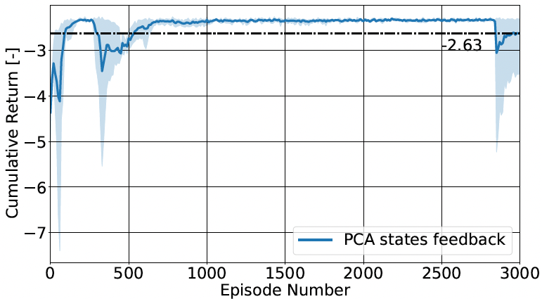
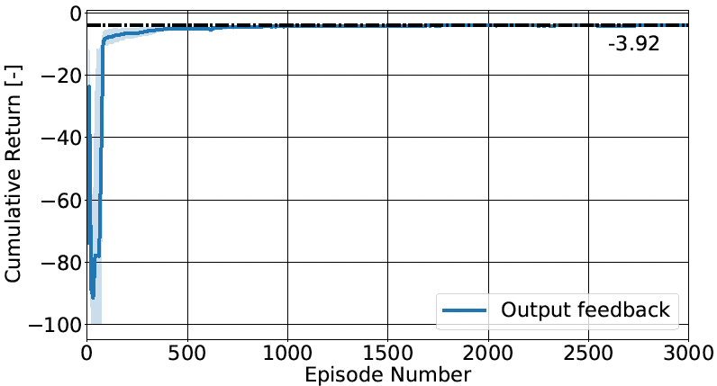
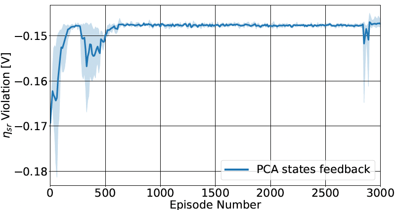
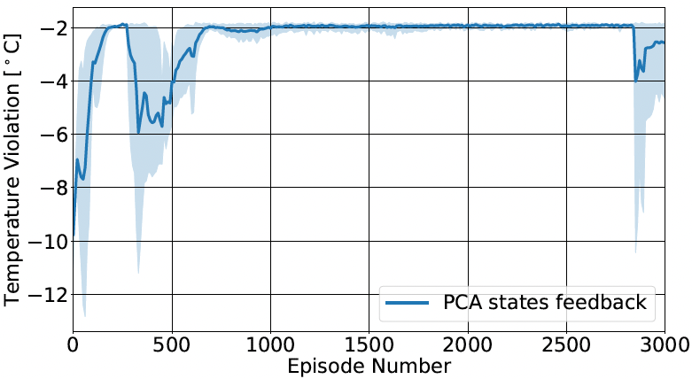
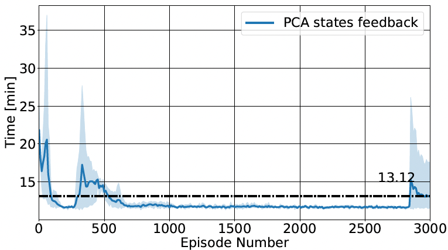
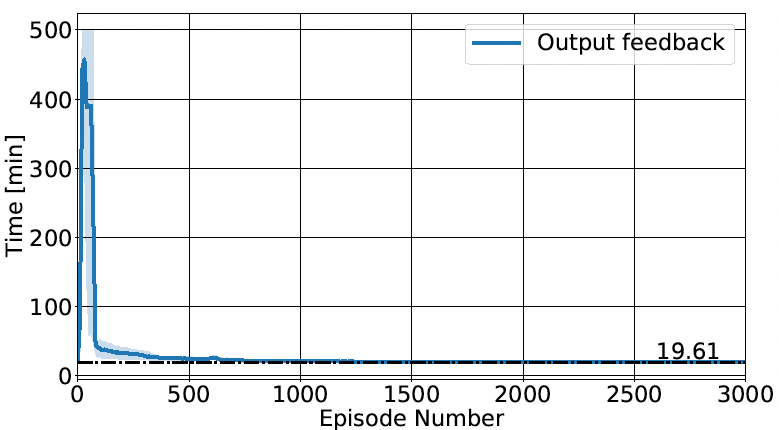

# RL-BATT-DDPG

This is the application of reinforcement learning (RL) for battery fast-charging in the advanced battery management system (BMS). Using deep deterministic policy gradient (DDPG) algorithm, the RL agent is able to achieve fast-charging control strategy compared to existing model-based control strategies. In this repo, the RL results are reproduced by using the publicly available Lithium cobalt battery (LiCoO2) battery chemistry. Specifically, we present the RL agent in terms of state-feedback and output-feedback learning policy, which can be found in the sub-folders. 

## Requirements

* Python 3.7 (it might work with Python 2, but I didn't test it)
* [PyTorch 1.2.0](http://pytorch.org/)
* [OpenAI baselines](https://github.com/openai/baselines)

## How to run

* In the "settings_file.py" for each folder, the training settings and constraints are defined. For RL training configuration, the hyper-paramters are defined in "model.py".

* You can simply run the code and reproduce the results in the folder by following:
* You can try with different parameter initialization using additional argument, i.e., --id 0, --id 1, ...

```bash
# Training & Testing
python main_training_testing_output_fdbk.py --id 0
python main_training_testing_state_fdbk.py --id 0
```

* After training the RL agent, one can evaluate the performance of RL controller by executing notebook:
```bash
# Evaluation & Visualization
jupyter notebook

```

* Launch the notebook file (.ipynb) in the sub-folder for deeper analysis.

Figures and Results are saved in "figures" in each subfolders of the repository. The figures in the manuscript are different from repository results because the battery model is adopted from company-owned battery parameters.

## Results

### Learning Curve






### Li-plating Constraint Violation




### Voltage Constraint Violation


### Temperature Constraint Violation




### Charging Time






## Bibtex

To be updated.

## Contacts

Saehong Park: sspark@berkeley.edu

Andrea Pozzi: andrea.pozzi03@universitadipavia.it

Aaron Kandel: aaronkandel@berkeley.edu


